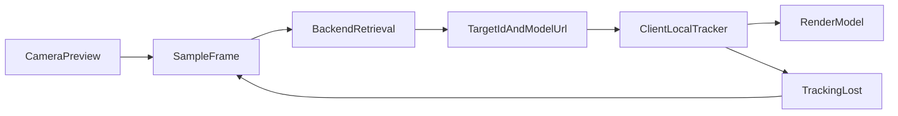

# 最优图像识别 AR 方案说明

## 结论

如果你的场景是：

- 后端目标图会越来越多
- 目标图不会长期固定在前端
- 匹配成功后要显示对应模型
- 效果既要稳，又要能扩展

那么最好的方法不是“纯 8th Wall 前端本地扫描”，也不是“每一帧都完全依赖后端返回姿态”。

最优方案是：

**后端检索 + 前端本地跟踪 的混合方案**

也就是：

1. 前端从摄像头取一帧
2. 后端在大图库里检索最可能的目标图
3. 后端只返回命中的 `targetId`、`modelUrl`，以及必要的候选信息
4. 前端再只对这一个命中的目标做本地跟踪
5. 跟踪稳定后显示并持续更新模型

这样既能支持“后端图库持续增长”，又能保留本地 AR 跟踪的流畅度和稳定性。

---

## 为什么这才是最优

### 方案 1：纯 8th Wall 本地 image target

这就是 8th Wall 官方以前最常用的方式：

- 所有目标图提前放到前端
- 前端本地持续扫描
- 命中哪张图就显示哪一个模型

优点：

- 实时性最好
- 姿态最稳
- 模型贴图效果最好
- 不依赖网络往返

缺点：

- 目标图一多就不适合
- 每增加一个目标图都要重新更新前端资源
- 不适合“后台图库不断增长”的业务

结论：

**如果目标图很少而且固定，这个最好。**
**如果目标图很多并且会持续增加，这个不是最好。**

---

### 方案 2：纯后端匹配并返回姿态

流程是：

- 前端截一帧
- 发后端
- 后端提特征、匹配、算姿态
- 返回 `targetId + modelUrl + corners/pose`
- 前端直接显示模型

优点：

- 前端不需要维护所有目标图
- 后端可以统一管理图库
- 扩展性比纯前端好

缺点：

- 每次识别都依赖网络
- 延迟会直接影响模型稳定性
- 如果每一帧都依赖后端姿态，画面会抖、会卡、会断续
- 后端压力会越来越大

结论：

**这个方案适合先把流程跑通。**
**但如果追求真正好用的 AR 效果，它不是最终最优。**

---

### 方案 3：后端检索 + 前端本地跟踪

这才是推荐的最终方案。

流程：

1. 前端打开摄像头预览
2. 按固定频率截取少量帧
3. 把这一帧发给后端做大图库检索
4. 后端返回最可能命中的 `targetId`
5. 前端拿到 `targetId` 后，只激活这一张图的本地识别/跟踪
6. 本地跟踪成功后，模型持续贴在目标图上
7. 跟踪丢失时，再回到“截帧 -> 后端检索”的流程

优点：

- 后端负责“从很多图里找到是哪张”
- 前端负责“识别后持续稳定跟踪”
- 兼顾扩展性和 AR 体验
- 不需要把整个图库永久塞进前端
- 用户看到的效果最接近官方 image target 的顺滑程度

缺点：

- 实现复杂度最高
- 前后端协作设计要更清晰
- 需要维护“检索态”和“跟踪态”两套状态机

结论：

**如果你要的是长期最优方案，这个最好。**

---

## 对你当前项目的建议

你当前项目里已经有两类基础：

- `twomodel.html` / `index.html`：接近传统 8th Wall 本地 target 跟踪
- `moni.html`：已经开始转向“截帧 -> matcher -> 显示模型”的结构

所以最合理的演进路线不是推翻重来，而是分 3 步走。

### 第一步：先把当前 `moni.html` 跑通

目标：

- 截一帧
- 把少量关键特征或整帧送到 matcher
- 命中则返回 `targetId`
- 显示对应模型
- 不命中就不显示

这一步的价值是：

- 把“后端图库检索”这件事先做通
- 让前端不再依赖写死的目标图列表

### 第二步：把 mock matcher 替换成真实后端

后端需要做：

- 目标图库管理
- 目标图离线建库
- 在线提特征
- 匹配打分
- 返回 `targetId`、`score`、`modelUrl`

这一阶段先不用强求完整实时姿态，只要“命中哪个图”是准的就行。

### 第三步：升级成混合方案

最终把系统改成两段式：

- 检索阶段：后端负责从大图库中找出候选目标
- 跟踪阶段：前端只对候选目标做本地跟踪并渲染模型

这一步完成后，效果会明显优于“每次都靠后端返回姿态”的方案。

---

## 推荐的数据流

这个流程里：

- 后端解决“海量图库检索”
- 前端解决“实时稳定显示”

这是大多数需要“多目标 + AR 跟踪 + 可扩展”的场景里最合理的职责划分。

---

## 后端算法建议

### MVP

- ORB 特征点
- BFMatcher + Hamming
- RANSAC Homography

适合：

- 先把系统打通
- 先验证目标图识别可行性

### 进阶

- 全局向量检索做粗排
- 局部特征匹配做精排
- Homography / PnP 做几何验证

适合：

- 目标图库较大
- 需要更快检索速度
- 需要更稳的误识别控制

---

## 前端职责建议

前端不要再长期持有完整图库，只做这几件事：

- 打开摄像头
- 低频截帧
- 调 matcher 接口
- 根据 `targetId` 加载模型
- 命中后进入本地跟踪态
- 未命中或跟踪丢失时清空模型

前端的关键不是“知道所有目标图”，而是“知道当前命中的这一张该显示哪个模型”。

---

## 最终建议

如果只问一句话：

**你这个项目最好的方法，是“后端做大图库检索，前端做命中目标的本地实时跟踪”，不要长期停留在纯前端全量扫描，也不要长期停留在纯后端逐帧姿态返回。**

原因很简单：

- 纯前端扫描：扩展性不够
- 纯后端姿态：实时性不够
- 混合方案：扩展性和体验最平衡

---

## 当前项目里的落地建议

现在建议按下面顺序推进：

1. 保留当前 `moni.html` 的 matcher 架构
2. 先把真实 `/api/match-frame` 接上
3. 后端先稳定返回 `targetId + score + modelUrl`
4. 再增加“命中后只跟踪这一张图”的前端本地跟踪模块
5. 最后再做姿态平滑、连续命中确认、失败回退

这样你不会走弯路，也不会一开始就把所有复杂度都压到后端。
